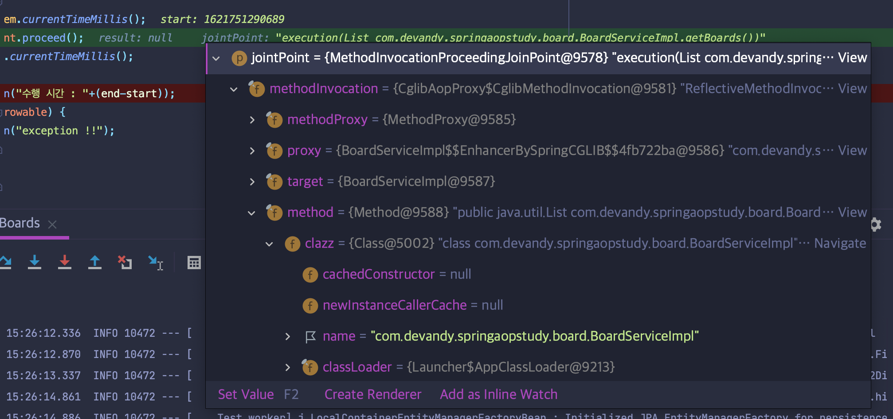

# Spring Aop

동욱님 블로그([기억보단 기록을](https://jojoldu.tistory.com/69)) 글을 통해 스프링 AOP를 학습하고 이를 정리했다.

중복된 코드가 발생하는 상황과 이를 해결하는 과정(상속, DI, 리팩토링) 그리고 이를 AOP로 가장 깔끔하게 해결하는 것으로 챕터를 4개로 나뉘어주셔서 각각의 챕터에 맞게 브랜치를 구분하여 코딩을 했다.

- [Chapter 1](#01) : 프로그램 실행 흐름 사이에 필요한 코드가 중복되는 상황을 상속으로 해결
- [Chapter 2](#02) : 부모 객체에 종속적인 상황을 피하고자 DI로 구조 변경
- [Chapter 3](#03) : 기존 코드 변경없이 애플리케이션 전반에 걸친 공통기능 모듈(Aspect) 구현
- [Chapter 4](#04) : chapter3에서 구현한 공통기능 모듈(Aspect)를 다른 클래스에서도 사용 (`Performance` 리팩토링)

 

## Chapter 1

- 원문 글 : [기억보단 기록을 - AOP 정리(1)](https://jojoldu.tistory.com/69)

- 구현 코드 저장소 : [https://github.com/youngjinmo/SpringAopStudyByJojoldu/tree/788c603aa1522c3fb8ce80533dddb66ec6234d3c](https://github.com/youngjinmo/SpringAopStudyByJojoldu/tree/788c603aa1522c3fb8ce80533dddb66ec6234d3c)

- 목적 : 프로그램 실행 흐름 사이에 필요한 코드가 중복되는 상황을 상속으로 해결

---

게시판과 사용자 객체를 DB에 저장할때 시간을 측정하는 코드를 삽입하는 상황을 예로 들었다.

**BoardService.java**

~~~java
import org.springframework.beans.factory.annotation.Autowired;
import org.springframework.stereotype.Service;

import java.util.List;

@Service
public class BoardService {
   @Autowired
   private BoardRepository boardRepository;

   public List<Board> getBoards() {
      long start = System.currentTimeMillis();
      List<Board> boards = repository.findAll();
      long end = System.currentTimeMillis();
   
      System.out.println("수행 시간 : "+(end-start));
      return boards;
   }
}
~~~

[UserService](https://github.com/youngjinmo/SpringAopStudyByJojoldu/blob/cc4b0db8d4/src/main/java/com/devandy/springaopstudy/user/UserService.java)에도 위와같이 코드를 삽입해줘야 한다. 이렇게 되면 중복코드가 발생할뿐더러 각각의 메소드들이 하나의 역할/책임을 갖지 못하고 여러 역할을 수행하게 된다.

이를 해결하는 방법으로 Chapter 1에서는 상속을 이용했다.

시간측정관련 코드만 분리해서 새로운 클래스를 생성했다.

**BoardPerformance.java**

~~~java
import java.util.List;

public abstract class BoardPerformance {
   private long before() {
      return System.currentTimeMillis();
   }
  
   private void after(long start) {
      long end = System.currentTimeMillis();
      System.out.println("수행 시간 : "+(end-start));
   }
  
   private List<Board> getBoards() {
      long start = before();
      List<Board> boards = findAll();
      after(start);
      return boards;
   }
  
   public abstract List<Board> findAll();
}
~~~

 그리고 이 클래스를 BoardService에서 상속받도록 구현했다.

~~~java
import org.springframework.beans.factory.annotation.Autowired;
import org.springframework.stereotype.Service;

import java.util.List;

@Service
public class BoardService extends BoardPerformance {
   
   @Autowired
   private BoardRepository boardRepository;
  
   @Override
   private List<Board> findAll() {
      return boardRepository.findAll();
   }
}
~~~

이렇게하면 구조도는 아래와 같이 개선된다.

이렇게까지 해도 `BoardPerformance`와 `UserPerformance`에 중복이 발생하기 때문에 이 중복코드는 제네릭을 통해 해결을 한다.

**SuperPerformance.java**

~~~java
public abstract class SuperPerformance<T> {
   private long before() {
      return System.currentTimeMillis();
   }
  
   private void after(long start) {
      long end = System.currentTimeMillis();
   }
  
   public List<T> getDatas() {
      long start = before();
      List<T> datas = findAll();
      after(start);
      return datas;
   }
  
   public abstract List<T> findAll();
}
~~~

제네릭 타입으로 `Board` 객체가 들어오면 `BoardPerformance`로서의 역할을, `User` 객체가 들어오면 `UserPerformance`로서의 역할을 기대할수가 있다. 제네릭이 모르는 분들이라면 아래 링크 참고

- [DevAndy - LiveStudy 14주차 제네릭](https://youngjinmo.github.io/2021/03/livestudy-week-14/) 

이제 `BoardService`와 `UserService`에서 `SuperPerformance`를 상속하도록 리팩토링한다.

~~~java
@Service
public class BoardService extends SuperPerformance<Board> { ... }

@Service
public class UserService extends SuperPerformance<User> { ... }
~~~

원글의 저자이신 동욱님께서는 부모 클래스에 의존하는 문제는 <u>이펙티브 자바</u>를 언급하시면서 피하는게 좋다고 말씀을 하신다. 

이펙티브 자바를 읽지않아서 아직은 와닿지 않지만, 일단 여기까지 마무리하고, Chapter 2에선 DI로 이 문제를 해결한다.

 

## Chapter 2

- 원문 글 : [기억보단 기록을 - AOP 정리(2)](https://jojoldu.tistory.com/70)

- 구현 코드 저장소 : [https://github.com/youngjinmo/SpringAopStudyByJojoldu/tree/chapter02](https://github.com/youngjinmo/SpringAopStudyByJojoldu/tree/chapter02)

- 목적 : 부모 객체에 종속적인 상황을 피하고자 DI로 구조 변경

---

DI로 상속관계를 해결할 경우 구조도는 아래와같이 변경된다.

`BoardService`를 인터페이스로 변경하고, 구현체로써 `BoardServiceImpl`이 구현을 하고, 시간측정 코드만 `BoardServicePerformance`로 분리하여  `BoardServicePerformance`에서 실행흐름을 제어하였다.

**BoardService.java**

~~~java
public interface BoardService {
   List<Board> getBoards();
}
~~~

**BoardServiceImpl.java**

~~~java
@Service
public class BoardServiceImpl implements BoardService {
   @Autowired
   private BoardRepository repository;
  
   @Override
   public List<Board> getBoards() {
      return repository.findAll();
   }
}
~~~

**BoardServicePerformance.java**

~~~java
@Service
@Primary
public class BoardServicePerformance implements BoardService {
   
   @Autowired
   @Qualifier("boardServiceImpl")
   private BoardService boardService;
  
   @Override
   public List<Board> getBoards() {
      long start = before();
      List<Board> boards = boardService.getBoards();
      after(start);
      return boards;
   }
  
   private long before() {
      return System.currentTimeMillis();
   }
  
   private void after(long start) {
      long end = System.currentTimeMillis();
      System.out.println("수행 시간 : "+(end-start));''
   }
} 
~~~

`@Qualifier` 어노테이션은 해당 필드에 어떤 빈을 주입할지를 지정할 수 있는 어노테이션이라고 한다.

~~~java
@Autowired
@Qualifier("boardServiceImpl")
private BoardService boardService;
~~~

파라미터로 들어온 빈 id에 해당하는 빈을 불러오는데, 현재의 프로젝트에선 인터페이스인 `BoardService` 객체의 구현체로 `BoardServiceImpl`을 지정하는것으로 생각할 수 있다.

`BoardServiceImpl`에 `@Service` 어노테이션을 작성함으로써 스프링에 빈으로 등록을 시켰는데, 이때 스프링에서 빈으로 생성할때 빈 ID값으로 `boardServiceImpl`이라고 저장되는것으로 추론된다. 스프링에서는 클래스명을 camelCase 표기법으로 빈 id를 저장하는것 같다.

이제 테스트!

동욱님은 JUnit4 환경에서 테스트를 하셨으나 나는 JUnit5로 테스트를 진행했다.

테스트 코드를 진행하기 앞서 애플리케이션이 DB에 `Board`와 `User` 객체를 10개씩 주입을 하겠다.

**SpringAopStudyApplication.java**

~~~java
@SpringBootApplication
@RestController
public class SpringAopStudyApplication implements CommandLineRunner {
  
   @Autowired
   private BoardService boardService;
  
   @Autowired 
   private UserService userService;
   
   @Override
   public void run(String... args) throws Exception {
      for (int i = 1; i <= 10; i++) {
      boardRepository.save(new Board(i+"번째 게시글의 제목", i+"번째 게시글의 내용"));
      userRepository.save(new User(i+"@gmail.com",i+"번째 사용자"));
      }
   }

   public static void main(String[] args) {
      SpringApplication.run(SpringAopStudyApplication.class, args);
   }
}
~~~

이제 진짜 테스트 코드!

**SpringAopStudyApplicationTests.java**

~~~java
@ExtendWith(SpringExtention.class)
@SpringBootTest
class SpringAopStudyApplicationTests {
  
   @Autowired
   private BoardService boardService;
  
   @Autowired
   private UserService userService;
  
   @Test
   @DisplayName("게시글 불러오기 테스트")
   public void getBoards() throws Exception {
      assertThat(boardService.getBoards().size()).isEqualsTo(10);
   }
}
~~~

)

UserService도 똑같이 코딩하고 테스트하면 통과할 수 있다.

그러나 아직은 문제가 존재한다.

지금은 `BoardService.getBoards()`와 `UserService.getUsers()`에만 시간측정하는 코드를 주입했는데, 만약 다른 서비스와 다른 메소드에 주입해야한다면 어떻게 해야할까?

Chapter 2에서 DI를 통해 애플리케이션 모듈간 결합도를 낮췄다면, Chapter3에서는 애플리케이션 전체에 걸쳐 기능을 재사용할 수 있도록 리팩토링한다.

 

## Chapter 3

- 원문 글 : [기억보단 기록을 - AOP 정리(3)](https://jojoldu.tistory.com/71)

- 구현 코드 저장소 : [https://github.com/youngjinmo/SpringAopStudyByJojoldu/tree/chapter03](https://github.com/youngjinmo/SpringAopStudyByJojoldu/tree/chapter03) 
- 목적 : 기존 코드 변경없이 애플리케이션 전반에 걸친 공통기능 모듈(Aspect) 구현

---

AOP에서 이야기하는 관점지향(Apect Oriented)라는 개념이 잘 이해되지 않았는데, 동욱님 포스팅을 통해 수월하게 이해할 수 있었다.

동욱님이 첨부하신 이미지를 첨부한다.

동욱님은 OOP와 AOP를 아래와 같이 정리하셨다.

- **OOP** : <mark>비즈니스 로직</mark>의 모듈화
  - 모듈화의 핵심 단위는 비지니스 로직
- **AOP** : <mark>인프라 혹은 부가기능</mark>의 모듈화
  - 대표적 예 : 로깅, 트랜잭션, 보안 등
  - 각각의 모듈들의 주 목적외에 필요한 부가적인 기능들

**AOP의 장점**

- 어플리케이션 전체에 흩어진 공통 기능이 하나의 장소에서 관리된다는 점
- 다른 서비스 모듈들이 본인의 목적에만 충실하고 그외 사항들은 신경쓰지 않아도 된다는 점

AOP도 OOP와 마찬가지로 공통된 기능을 재사용하는 기법이지만, 상속이나 DI로 처리하기엔 깔끔하지 않기 때문에 AOP가 필요하다고 한다.

 

## AOP 용어

### Aspect

OOP에서 객체지향 모듈을 오브젝트라고 부르듯이, AOP에선 부가기능 모듈을 Aspect라고 부른다. 

`Aspect = Advice + PointCut`

현재까지의 프로젝트에서 `SuperPerformance<>`가 Aspect에 해당한다.

### Target

부가기능을 부여할 <mark>대상</mark>에 해당한다. 

`BoardService`와 `UserService`가 Target에 해당한다.

### Advice

부가기능을 담은 <mark>구현체</mark>에 해당한다. 

Aspect가 <b>무엇</b>을, <b>언제</b> 할지를 정의한다.

### PointCut

부가기능이 <mark>적용될 대상(method)</mark>을 선정하는 방법에 해당한다.

이번 Chapter3부터 사용되는 개념이다. 

### JoinPoint

<mark>Advice가 적용될수 있는 위치</mark>이다.

Chapter4에서 사용된다.

### Proxy

Target을 감싸서 Target의 요청을 대신 받아주는 <mark>Wrapping Object</mark>이다.

클라이언트에서 Target을 호출하면, Target이 아닌 Target을 감싸는 Proxy가 호출되어 선처리 후 Target의 메소드를 실행, 후처리까지 실행한다.

### Weaving

지정된 객체에 Aspect를 적용해서 새로운 <mark>프록시 객체를 생성하는 과정</mark>이다.

Spring AOP에서는 런타임에서 프록시 객체가 생성된다.

 

Chapter 3에서는 **핵심 기능관점** 이었던 구조를 **부가기능 관점** 으로 변경한다.

`SuperPerformance` 대신 AOP 객체를 생성한다.

**Performance.java**

~~~java
@Aspect
public class Performance {
   @Around("execution(* com.devandy.springaopstudy.board.BoardService.getBoards(..))")
   public Object calculatePerformanceTime(ProceedingJoinPoint proceedingJoinPoint) {
      Object result = null;
      try {
         long start = System.currentTimeMillis();
         result = proceedingJoinPoint.proceed();
         long end = System.currentTimeMillis();
         System.out.println("수행 시간 : "+(end-start));
      } catch (Throwable throwable) {
         System.out.println("exception! ");
      }
      return result;
   }
}
~~~

여기서 사용된 `@Around` 는 <b>Advice</b>에 해당한다. Aspect가 무엇을 언제할지를 정의한다.

- 무엇 : `calculatePerformanceTime()`
- 언제 : `@Around`에서 정의한 **PointCut**

정리하면, PointCut에서 정의된 메소드가 호출될때 `calculatePerformanceTime()`을 호출한다는 이야기가 된다.

`@Around` 파라미터영역에 정의된 코드는 <b>PointCut</b>에 해당한다. 부가기능이 적용될 메소드를 지정한다.

`ProceedingJointPoint.proceed()`는 `@Around` 애노테이션으로 지정한 메소드에 해당한다.

`@Aspect`로 선언한 `Performance` 객체는 <b>Aspect</b>이면서 <b>Proxy</b>라고 할 수 있을것 같다.

이렇게 생성한 Aspect를 스프링에 의해 관리되기 위해서는 빈으로 주입해야 한다.

**SpringStudyAopApplication.java**

~~~java
@SpringBootApplication
@RestController
@EnableAspectJAutoProxy
public class SpringAopStudyApplication implements CommandLineRunner {
   ...
   @Bean
   public Performance performance() {
      return new Performance();
   }
   ...
}
~~~

먼저 어노테이션 `@EnableAspectJAutoProxy`를 선언하면, 스프링에서 런타임시에 자동으로 Aspect 객체를 Proxy로 호출해준다. 이런 과정을 다이내믹 프록시라고도 한다.

이번 Chapter 3에서 눈에 띄는점은 <mark>기존 코드를 건드리지않고,</mark> Aspect를 선언하고 이를 빈으로 등록함으로써 애플리케이션 전반에 걸쳐 공통기능을 모듈화(Aspect)해서 사용할 수 있게되었다는 점이다.

테스트 코드를 디버깅모드로 실행하여 확인한 결과 `ProceedingJoinPoint.proceed()`가 실행되는 지점에 브레이크 포인트를 걸어서 확인해보니 <b>JointPoint</b>가 `BoardServiceImpl`로 지정된걸 확인할 수 있었다. 의도한대로 스프링에서 Aspect 객체를 Proxy로 호출한걸 확인한것이다.

 

## Chapter 4

- 원문 글 : [기억보단 기록을 - AOP 정리(4)](https://jojoldu.tistory.com/72)

- 구현 코드 저장소 : [https://github.com/youngjinmo/SpringAopStudyByJojoldu/tree/chapter04](https://github.com/youngjinmo/SpringAopStudyByJojoldu/tree/chapter04) 
- 목적 : chapter3에서 구현한 공통기능 모듈(Aspect)를 다른 클래스에서도 사용 (`Performance` 리팩토링)

---

chapter3에서는 `BoardService`에서만 Aspect(공통기능 모듈)를 활용했다. 이젠 이렇게 만들어놓은 Aspect를 `UserService`에서도 사용할 수 있도록 `Performance`를 리팩토링한다.

~~~java
@Aspect
public class Performance {
   @Pointcut("execution(* com.devandy.springaopstudy.board.BoardService.getBoards(..))")
   public void getBoards() { }
  
   @Pointcut("execution(* com.devandy.springaopstudy.user.UserService.getUsers(..))")
   public void getUsers() { }
  
   @Around("getBoards() || getUsers()")
   public Object calculatePerformanceTime(ProceedingJoinPoint proceedingJoinPoint) {
      Object result = null;
      try {
         long start = System.currentTimeMillis();
         result = proceedingJoinPoint.proceed();
         long end = System.currentTimeMillis();
         System.out.println("수행 시간 : "+(end-start));
       } catch (Throwable throwable) {
         System.out.println("exception! ");
       }
       return result;
   }
}
~~~

Advice에서 정의하는 언제, 즉 PointCut을 메소드로 분리했다. 개인적으로 이 부분이 흥미로웠다. 스프링에선 모든게 객체로 분리할 수 있는것 같았다.

[chapter3](#03)에서와 마찬가지로 `UserService` 코드를 단 한줄도 건드릴 필요없이 AOP를 적용할 수 있었다.

 
